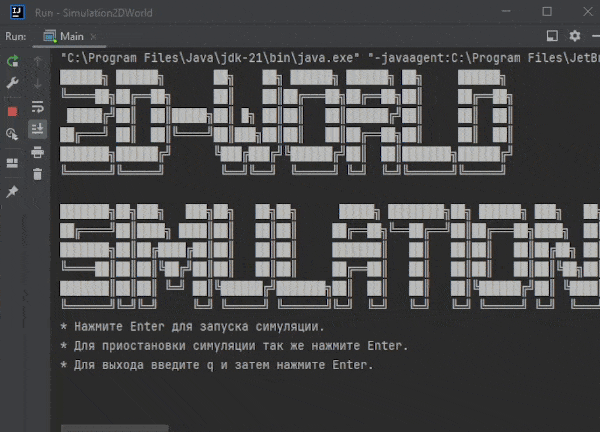

<h1 style="text-align: center;">Проект для самообучения “Симуляция”</h1>

Суть проекта - пошаговая симуляция 2D мира, населённого травоядными и хищниками. Кроме существ, мир содержит ресурсы 
(траву), которыми питаются травоядные, и статичные объекты, с которыми нельзя взаимодействовать - они просто занимают 
место.

2D мир представляет из себя матрицу NxM, каждое существо или объект занимают клетку целиком, нахождение в клетке 
нескольких объектов/существ - недопустимо.

### Оглавление

1. [Что нужно знать](#что-нужно-знать)
2. [Мотивация проекта](#мотивация-проекта)
3. [Дизайн классов](#дизайн-классов)
    * [Entity](#entity)
    * [Grass, Rock, Tree](#grass-rock-tree)
    * [Creature](#creature)
    * [Herbivore](#herbivore)
    * [Predator](#predator)
    * [Map](#map)
    * [Simulation](#simulation)
    * [Actions](#actions)
4. [Поиск пути](#поиск-пути)
5. [Рендерер](#рендерер)
6. [Конечная цель](#конечная-цель)
7. [Реализация](#реализация)
    * [Общее описание](#общее-описание)
    * [Полученные и закрепленные знания](#полученные-и-закрепленные-знания)
    * [Запуск симуляции](#запуск-симуляции)

### Что нужно знать

Java - коллекции, ООП

### Мотивация проекта

Основная цель - демонстрация принципов дизайна архитектуры приложения с помощью ООП. Описанная ниже структура классов 
не является всеобъемлющей, предполагается что студент будет ей следовать, взяв за основу.

### Дизайн классов

### `Entity`
Корневой абстрактный класс для всех существ и объектов существующих в симуляции.

### `Grass, Rock, Tree`
`Rock`, `Tree` - статичные объекты. `Grass` - ресурс для травоядных.

### `Creature`
Абстрактный класс, наследуется от `Entity`. Существо, имеет скорость (сколько клеток может пройти за 1 ход), количество 
HP. Имеет абстрактный метод `makeMove()` - сделать ход. Наследники будут реализовывать этот метод каждый по-своему.

### `Herbivore`
Травоядное, наследуется от `Creature`. Стремятся найти ресурс (траву), может потратить свой ход на движение в сторону 
травы, либо на её поглощение.

### `Predator`
Хищник, наследуется от `Creature`. В дополнение к полям класса `Creature`, имеет силу атаки. На что может потратить 
ход хищник:

* Переместиться (чтобы приблизиться к жертве - травоядному)
* Атаковать травоядное. При этом количество HP травоядного уменьшается на силу атаки хищника. Если значение HP жертвы 
* опускается до 0, травоядное исчезает

### `Map`
Карта, содержит в себе коллекцию для хранения существ и их расположения. Советую не спешить использовать двумерный 
массив или список списков, а подумать какие ещё коллекции могут подойти.

### `Simulation`
Главный класс приложения, включает в себя:
* Карту
* Счётчик ходов
* Рендерер поля
* Actions - список действий, исполняемых перед стартом симуляции или на каждом ходу (детали ниже)

Методы:
* `nextTurn()` - просимулировать и отрендерить один ход
* `startSimulation()` - запустить бесконечный цикл симуляции и рендеринга
* `pauseSimulation()` - приостановить бесконечный цикл симуляции и рендеринга

### `Actions`
`Action` - действие, совершаемое над миром. Например - сходить всеми существами. Это действие итерировало бы существ и 
вызывало каждому `makeMove()`. Каждое действие описывается отдельным классом и совершает операции над картой. Симуляция 
содержит 2 массива действий:
* initActions - действия, совершаемые перед стартом симуляции. Пример - расставить объекты и существ на карте
* turnActions - действия, совершаемые каждый ход. Примеры - передвижение существ, добавить травы или травоядных, если 
их осталось слишком мало

### Поиск пути
Советую писать алгоритм поиска пути полностью с нуля, используя в качестве источника описание алгоритма на википедии. 
Проще всего начать с алгоритма [поиска в ширину](
https://ru.wikipedia.org/wiki/%D0%9F%D0%BE%D0%B8%D1%81%D0%BA_%D0%B2_%D1%88%D0%B8%D1%80%D0%B8%D0%BD%D1%83). 
Он относительно простой в реализации, но может работать медленно на больших полях, для которых лучше подойдет алгоритм 
[A*](https://ru.wikipedia.org/wiki/A*).

### Рендерер
Рендерер ответственен за визуализацию состояния поля, его отрисовку. По желанию студента интерфейс приложения может 
быть консольным, либо графическим.

### Конечная цель
Реализовать симуляцию и подобрать различные значения так, чтобы взаимодействия внутри мира получились максимально 
интересными:
* Размер поля
* Диапазоны HP и скорости существ
* Диапазон атаки хищников

Опциональные идеи для усложнения проекта:
*  Механика размножения существ
* Механика голода, когда от отсутствия пищи у них начинает уменьшаться HP

Источник [(Сергей Жуков)](https://zhukovsd.github.io/java-backend-learning-course/projects/simulation/)

### Реализация
### `Общее описание`

<br>Программа не имеет графического интерфейса, рендерится в консоль. <br>
Структура программы соответствует той что указана в задании. <br>
Все объекты и существа хранятся в HashMap, по ключу в виде координат строка-столбец. <br>
Для поиска пути использовался алгоритм поиска в ширину. Для
оптимизации у каждого существа используется поле "path", в котором храним найденный путь в виде двусторонней очереди. В 
начале каждого хода проверяется есть ли ещё по координатам конечной точки пути из "path" цель, которую мы искали. Если 
есть, то поиск не проводится, а делается следующий шаг по пути из "path", при условии что следующая ячейка свободна.<br>
Создан класс Settings в который вынесены константы для настройки мира. Такие, как количество объектов и существ, 
скорость, очки здоровья, размер мира, возможность перемещения по диагонали и др.

### `Полученные и закрепленные знания`
Получена практика в написании алгоритма поиска в ширину. Использование шаблона Singleton - в программе во время 
выполнения может существовать только одна карта мира. Использование дженериков. Работа с коллекциями - очередь, 
двунаправленная очередь, хэш таблицы. ООП.

### `Запуск симуляции`
Запуск из IDE через метод main() в классе Main.

Для запуска без IDE в командной строке необходимо перейти в папку проекта **src/main/java** и сначала скомпилировать 
файлы, выполнив команду:
```
javac -d ../bin ru/vladshi/javalearning/Main.java
```

И затем что бы запустить игру перейти в папку **/bin** и выполнить команду:
```
java ru.vladshi.javalearning.Main
```